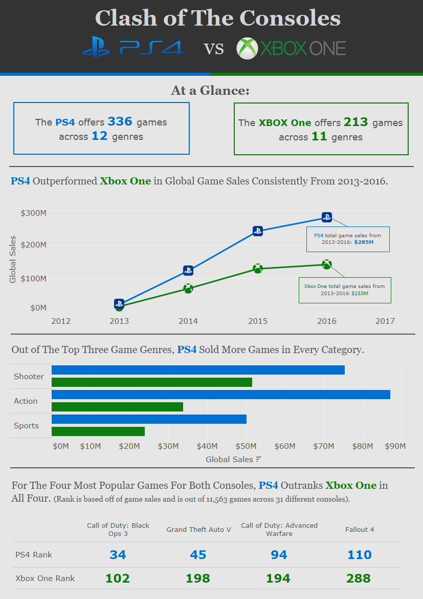

## Product Line Comparison: PS4 vs. Xbox One

### Overview
This Tableau project analyzes global video game sales data (2013–2016) to compare two competing product lines — PlayStation 4 and Xbox One. The dashboard highlights differences in product availability, sales performance across regions, and top-selling genres/titles. The project was completed as part of a Tableau data visualization course and demonstrates how to transform a large dataset into a static, insight-driven dashboard.  

### Business Relevance
While the dataset focuses on gaming consoles, the same approach can be applied to real-world corporate scenarios such as:  
- Comparing performance across competing product lines within a company  
- Tracking market share between brands over time  
- Analyzing regional sales performance to guide distribution or marketing strategies  
- Identifying top-performing products for inventory or promotional focus  

By using sales data segmented by region, category, and product, the analysis provides decision-makers with a clear picture of competitive positioning and areas of opportunity — a framework that is valuable for any industry with multiple product lines or market segments.  

### Tech Stack
- **Tool**: Tableau  
- **Techniques**: Data visualization, KPI tracking, trend analysis, category comparison, regional segmentation  
- **Data Source**: Video game sales dataset (15,405 rows, 1980–2016) from Kaggle  

  
